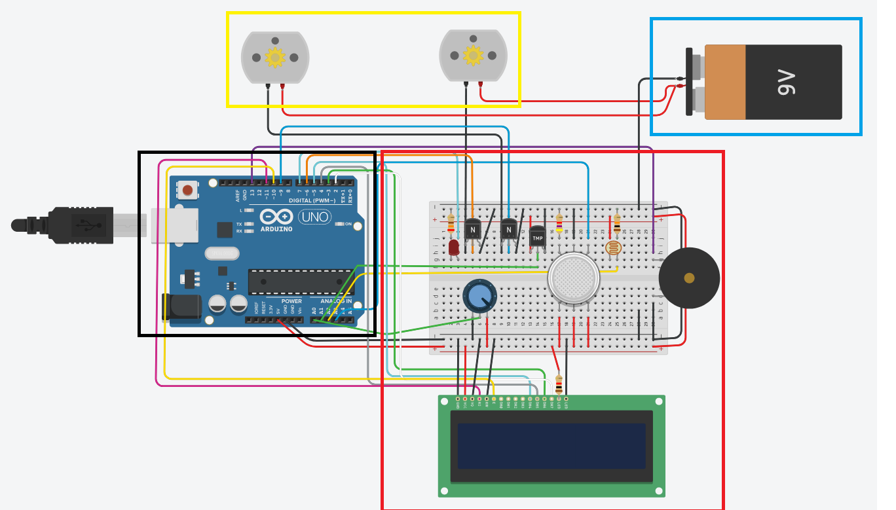
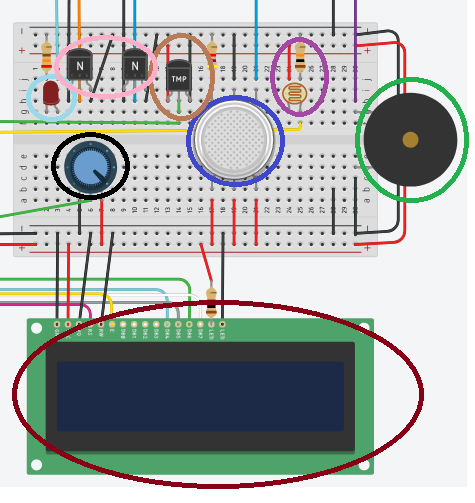
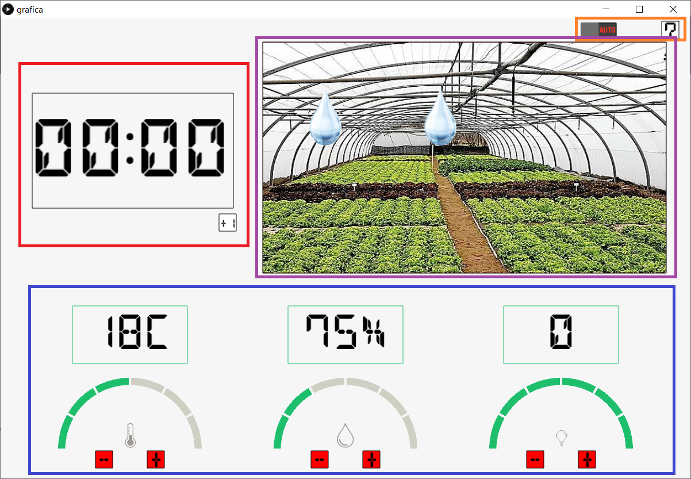

# smart_garden
Jardín automático con arduino.
<!-- PROJECT LOGO -->
 

  <h3 align="center">Jardín automático con arduino</h3>

  

    ¡Obtén ayuda para cuidar tu huerto!
     
      <a href="https://github.com/carlosepb/smart_garden"><strong>Explorar repositorio»</strong></a>
     
     
      <a href="https://github.com/carlosepb/smart_garden/issues">Reportar Error</a>
      ·
      <a href="https://github.com/carlosepb/smart_garden/issues">Solicitar Colaboración</a>
    

  

<!-- TABLE OF CONTENTS -->

  
Tabla de Contenido

  <ol>
    <li>
      <a href="#sobre-el-proyecto">Sobre el Proyecto</a>
      <ul>
        <li><a href="#herramientas-de-desarrollo">Herramientas de Desarrollo</a></li>
      </ul>
    </li>
    <li><a href="#trabajo-realizado">Trabajo Realizado</a></li>
    <li>
      <a href="#empezando">Empezando</a>
      <ul>
        <li><a href="#prerrequisitos">Prerrequisitos</a></li>
        <li><a href="#instalación">Instalación</a></li>
        <li><a href="#ejecutar">Ejecutar</a></li>
      </ul>
    </li>
    <li><a href="#hoja-de-ruta">Hoja de Ruta</a></li>
    <li><a href="#licencia">Licencia</a></li>
    <li><a href="#contacto">Contacto</a></li>
    <li><a href="#agradecimientos">Agradecimientos</a></li>
  </ol>

<!-- ABOUT THE PROJECT -->
## Sobre el Proyecto

En el ámbito que hemos querido centrar nuestro proyecto es en el hecho de que cada vez
es más habitual que las personas instalen huertos para consumo privado en sus hogares.
En algunos casos estos se instalan en lugares de acceso menos habitual como azoteas,
trasteros o sótanos los cuales no solemos ver de manera regular y este proyecto trata sobre
una solución que nos permita llevar un control del mismo desde nuestro terminal e incluso
que en caso de que sea necesario el sistema pueda realizar ajuste en el entorno mediante
soportes de riego, calefacción y luz de manera automática.

Las tecnologías empleadas son Processing y Tinkercad
(aunque esta es más bien un sustituto de toda la parte hardware no disponible,
mismamente podríamos decir que es un Arduino con una variedad de sensores conectados
a su alrededor), describiendo a continuación el trabajo realizado con ambas tecnologías.

## Trabajo Realizado

Como ya detallamos anteriormente las tecnologías empleadas son Processing y Tinkercad
(aunque esta es más bien un sustituto de toda la parte hardware no disponible,
mismamente podríamos decir que es un Arduino con una variedad de sensores conectados
a su alrededor), describiendo a continuación el trabajo realizado con ambas tecnologías.

Comenzando por el apartado de Tinkercad como ya hemos indicado la idea es simular un
huerto o invernadero automático a través de los datos obtenidos de esos sensores pudiendo
activar automáticamente la ventilación, riego automático o luz si es necesario. (imagen_1.0)

Además, se ha añadido un sistema antiincendios que activa automáticamente el sistema
de riego para minorizar los riesgos y se activa un sonido para que los usuarios tengan
conocimiento del incendio en caso de que no estén observando el huerto. (imagen_1.0)

Y se ha añadido una pantalla LCD donde se pueda observar los datos de temperatura y
humedad a tiempo real y en caso de que salte la alarma antiincendios salga un mensaje
con el número para llamar a los bomberos. (imagen_1.0)

Se ha añadido una pila para conseguir una mayor potencia en los sistemas reactivos y tener un rango mayor al regular estos elementos, esto lo hacemos porque la potencia suministrada por la placa es insuficiente.. (imagen_1.0)

Hemos hecho que el sistema sea menos reactivo, haciendo que, en lugar de tener un único umbral 
para arrancar la ventilación, los calefactores, la luz y el riego de manera automática, habrá 
distintos rangos en los que los motores irán funcionando a distintas potencias. (imagen_1.0)

También para reducir los errores con muestras espurias el resultado que se utiliza para comprobar si es necesaria una acción del sistema no es una única muestra si no la media de varias de ellas. (imagen_1.0)

Por lo que tendremos distintos umbrales de temperatura que harán que poco a poco según vaya 
subiendo o bajando la temperatura el calefactor funcione a una mayor o menor potencia, evitando 
tanta reactividad, lo cual ayudará a que el prototipo tenga una mayor vida útil. Esto ha sido 
implantado para todos los elementos. (imagen_1.0)

Por lo que tendremos distintos umbrales de temperatura que harán que poco a poco según vaya 
subiendo o bajando la temperatura el calefactor funcione a una mayor o menor potencia, evitando 
tanta reactividad, lo cual ayudará a que el prototipo tenga una mayor vida útil. Esto ha sido 
implantado para todos los elementos. (imagen_1.0)

Elementos: 

<ul>
    <li>
    Empezando de izquierda a derecha tenemos el círculo azul claro donde está
    conectado el led que conectará la luz o no según el sensor de fotorresistencia
    detecte cuan cantidad de luz haya. (imagen_1.1)
    </li>
    <li>
    El círculo negro al Tinkercad no poseer detector de humedad usamos un
    potenciómetro que usaremos de manera manual para realizar las pruebas según
    queramos que haya más o menos humedad. (imagen_1.1)
    </li>
    <li>
    Luego tenemos el círculo azul que es el sensor de gas, pero en nuestro caso lo
    usaremos como sensor de humo el cual detectará si hay humo cerca del sensor
    activando una alarma que sería el piezo (círculo verde). (imagen_1.1) 
    </li>
    <li>
    El círculo morado sería el sensor de fotorresistencia que nos indica la cantidad
    de luz que detecta. También la cambiaremos de manera manual para realizar las
    pruebas. (imagen_1.1)
    </li>
    <li>
    El círculo rosa serían una pareja de transistores NPN el cual tiene dos funciones básicas,       ser un interruptor electrónico o un amplificador. En este caso lo usamos como amplificador..     (imagen_1.1)
    </li>
    <li>
    Y para acabar el círculo rojo es la pantalla LCD donde se mostrarán los datos
    de humedad y temperatura y en caso de que haya un incendio mostrará el número
    de teléfono de los bomberos para rápida actuación del usuario. (imagen_1.1) 
    </li>
</ul>

El entorno gráfico podemos observarlo a continuación.

Elementos: 

<ul>
    <li>
    El primer bloque (COMPONENTE), situado arriba a la izquierda, es para la
    activación manual de elementos lumínicos, de riego y de temperatura. (imagen_1.2)
    </li>
    <li>
    El segundo bloque, arriba a la derecha es la cámara, donde controlaremos de
    manera visual lo que ocurre en nuestro huerto, permitiéndonos esto saber el estado
    exacto del mismo sin necesidad de desplazarnos hasta el mismo. La cámara hace
    de veces de sensor de movimiento, cambiando de modo al hacer click sobre ese
    bloque. (imagen_1.2)
    </li>
    <li>
    Justo debajo encontramos el bloque del ESTADO DEL ENTORNO, donde
    tenemos una serie de gráficas que muestran el desarrollo durante el tiempo de las
    condiciones de humedad, temperatura y luz. (imagen_1.2) 
    </li>
    <li>
    Finalmente tenemos el bloque de abajo a la izquierda, marcado como
    POTENCIA, este bloque se usa para controlar los niveles de intensidad en el
    riego, la luminosidad y la temperatura. La potencia de riego se sitúa al máximo en
    caso de incendio, en caso contrario suele estar en un goteo ligero o incluso
    apagado. (En el proyecto actual no se encuentra incorporado debido a no poseer
    elementos de riego, luz o temperatura). (imagen_1.2)
    </li>
</ul>

## Herramientas de Desarrollo

* [Processing3](https://processing.org/download/)
* [Tinkercad](https://www.tinkercad.com/)

<!-- GETTING STARTED -->
## Empezando

Para modificar la aplicación y ejecutar necesitará instalar el entorno de desarrollo Processing3 y en caso de querer probar o modificar sistema virtual ardunino necesitará crear una cuenta en la página de thinkercad.

### Prerrequisitos

* Descargar y descomprimir Processing3, lo puedes encontrar [aquí](https://processing.org/download/).
* Crear una cuenta en la página de thinkercad, enlace [aquí](https://www.tinkercad.com/).

### Instalación
1. Para exportar a un archivo con formato gif animado es necesario instalar GifAnimation, lo puede encontrar [aquí](https://github.com/extrapixel/gif-animation).
2. Para utilizar la libreria OpenVC deberemos descargarla e instalarla desde [aquí](http://www.magicandlove.com/blog/2018/11/22/opencv-4-0-0-java-built-and-cvimage-library/).

### Ejecutar

1. Proyecto Processing.
    * Descomprimir zip.
    * Ejecutar Processin3.
    * Archivo->Abrir...

2. Proyecto Arduino.
    * Descomprimir zip.
    * Acceder a la página de thinkercad
    * Iniciar sesión
    * Abrir...

<!-- ROADMAP -->
## Hoja de Ruta

En este momento no hay planes de mejorar la aplicación.

<!-- LICENSE -->
## Licencia

Software completamente libre para copiar o distribuir.

<!-- CONTACT -->
## Contacto

Autor: Carlos Eduardo Pacichana Bastidas
Email: carlos.eduardo.pacichana@gmail.com  carlos.pacichana101@alu.ulpgc.es

Autor: Alejandro García Sosa
Email: alejandro.garcia134@alu.ulpgc.es

Autor: Alejandro Daniel Herrera Cárdenes
Email: alejandro.herrera113@alu.ulpgc.es

Autor: Javier Santana Álamo 
Email: javier.santana130@alu.ulpgc.es

Enlace al proyecto: [https://github.com/carlosepb/smart_garden](https://github.com/carlosepb/smart_garden)

<!-- ACKNOWLEDGEMENTS -->
## Agradecimientos
* [Processing](https://processing.org/)
* [Gif-animation](https://github.com/extrapixel/gif-animation)
* [Funprogramming](https://funprogramming.org/)
* [Text](https://processing.org/reference/text_.html)
* [Texturas](https://www.pexels.com/es-es/)
* [OpenVC 4.0.0](http://www.magicandlove.com/blog/2018/11/22/opencv-4-0-0-java-built-and-cvimage-library/)
* [Captura_Imagenes](https://github.com/otsedom/CIU/tree/master/P6/p6_camdiff)
