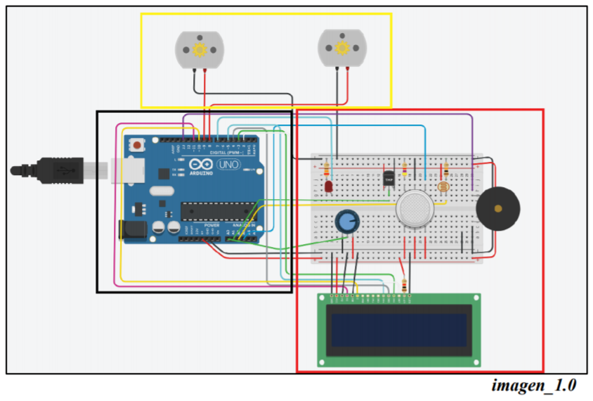

# smart_garden
Jardín automático con arduino.
<!-- PROJECT LOGO -->
 

  <h3 align="center">Jardín automático con arduino</h3>

  

    ¡Obtén ayuda para cuidar tu huerto!
     
      <a href="https://github.com/carlosepb/smart_garden"><strong>Explorar repositorio»</strong></a>
     
     
      <a href="https://github.com/carlosepb/PeduleShape/blob/main/images/animation.gif">Ver Demo</a>
      ·
      <a href="https://github.com/carlosepb/smart_garden/issues">Reportar Error</a>
      ·
      <a href="https://github.com/carlosepb/smart_garden/issues">Solicitar Colaboración</a>
    

  

<!-- TABLE OF CONTENTS -->

  
Tabla de Contenido

  <ol>
    <li>
      <a href="#sobre-el-proyecto">Sobre el Proyecto</a>
      <ul>
        <li><a href="#herramientas-de-desarrollo">Herramientas de Desarrollo</a></li>
      </ul>
    </li>
    <li><a href="#trabajo-realizado">Trabajo Realizado</a></li>
    <li>
      <a href="#empezando">Empezando</a>
      <ul>
        <li><a href="#prerrequisitos">Prerrequisitos</a></li>
        <li><a href="#instalación">Instalación</a></li>
        <li><a href="#ejecutar">Ejecutar</a></li>
      </ul>
    </li>
    <li><a href="#hoja-de-ruta">Hoja de Ruta</a></li>
    <li><a href="#licencia">Licencia</a></li>
    <li><a href="#contacto">Contacto</a></li>
    <li><a href="#agradecimientos">Agradecimientos</a></li>
  </ol>

<!-- ABOUT THE PROJECT -->
## Sobre el Proyecto

En el ámbito que hemos querido centrar nuestro proyecto es en el hecho de que cada vez
es más habitual que las personas instalen huertos para consumo privado en sus hogares.
En algunos casos estos se instalan en lugares de acceso menos habitual como azoteas,
trasteros o sótanos los cuales no solemos ver de manera regular y este proyecto trata sobre
una solución que nos permita llevar un control del mismo desde nuestro terminal e incluso
que en caso de que sea necesario el sistema pueda realizar ajuste en el entorno mediante
soportes de riego, calefacción y luz de manera automática.

Las tecnologías empleadas son Processing y Tinkercad
(aunque esta es más bien un sustituto de toda la parte hardware no disponible,
mismamente podríamos decir que es un Arduino con una variedad de sensores conectados
a su alrededor), describiendo a continuación el trabajo realizado con ambas tecnologías.

## Trabajo Realizado

Como ya detallamos anteriormente las tecnologías empleadas son Processing y Tinkercad
(aunque esta es más bien un sustituto de toda la parte hardware no disponible,
mismamente podríamos decir que es un Arduino con una variedad de sensores conectados
a su alrededor), describiendo a continuación el trabajo realizado con ambas tecnologías.

Comenzando por el apartado de Tinkercad como ya hemos indicado la idea es simular un
huerto o invernadero automático a través de los datos obtenidos de esos sensores pudiendo
activar automáticamente la ventilación, riego automático o luz si es necesario. (imagen_1.0)

Además, se ha añadido un sistema antiincendios que activa automáticamente el sistema
de riego para minorizar los riesgos y se activa un sonido para que los usuarios tengan
conocimiento del incendio en caso de que no estén observando el huerto. (imagen_1.0)

Y se ha añadido una pantalla LCD donde se pueda observar los datos de temperatura y
humedad a tiempo real y en caso de que salte la alarma antiincendios salga un mensaje
con el número para llamar a los bomberos. (imagen_1.0)

Elementos
  * Empezando de izquierda a derecha tenemos el círculo azul claro donde está
    conectado el led que conectará la luz o no según el sensor de fotorresistencia
    detecte cuan cantidad de luz haya.
  *
  *
  *
  *
  *
  .(imagen_5.0)

 imagen_4.0

El efecto del shape podemos verlo en la imagen inferior.(imagen_5.0)

 imagen_4.0

## Herramientas de Desarrollo

* [Processing3](https://processing.org/download/)

<!-- GETTING STARTED -->
## Empezando

Para modificar la aplicación y ejecutar necesitará instalar el entorno de desarrollo Processing3.

### Prerrequisitos

* Descargar y descomprimir Processing3, lo puedes encontrar [aquí](https://processing.org/download/).

### Instalación
1. Para exportar a un archivo con formato gif animado es necesario instalar GifAnimation, lo puede encontrar [aquí](https://github.com/extrapixel/gif-animation).
   
### Ejecutar

2. Proyecto.
    * Descomprimir rar.
    * Ejecutar Processin3.
    * Deberemos poner Processin3 en modo SHAPE
    * Archivo->Abrir...
   

<!-- ROADMAP -->
## Hoja de Ruta

En este momento no hay planes de mejorar la aplicación.

<!-- LICENSE -->
## Licencia

Software completamente libre para copiar o distribuir.

<!-- CONTACT -->
## Contacto

Autor: Carlos Eduardo Pacichana Bastidas

Email: carlos.eduardo.pacichana@gmail.com  carlos.pacichana101@alu.ulpgc.es

Enlace al proyecto: [https://github.com/carlosepb/PeduleShape](https://github.com/carlosepb/PeduleShape)

<!-- ACKNOWLEDGEMENTS -->
## Agradecimientos
* [Processing](https://processing.org/)
* [Gif-animation](https://github.com/extrapixel/gif-animation)
* [Funprogramming](https://funprogramming.org/)
* [Text](https://processing.org/reference/text_.html)
* [Texturas](https://www.pexels.com/es-es/)
* [Shape](https://github.com/otsedom/CIU/blob/master/P9/p9_shader_dibuja/Dibuja7.glsl)
